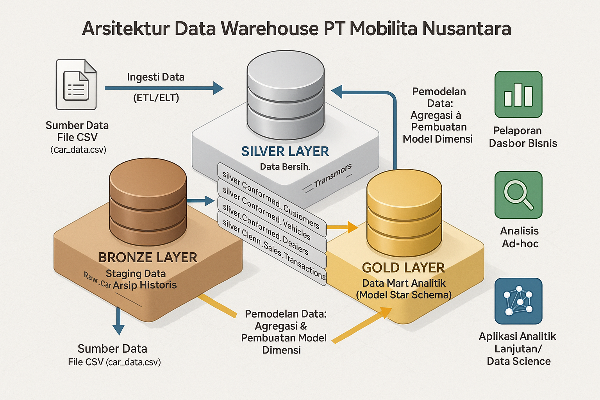
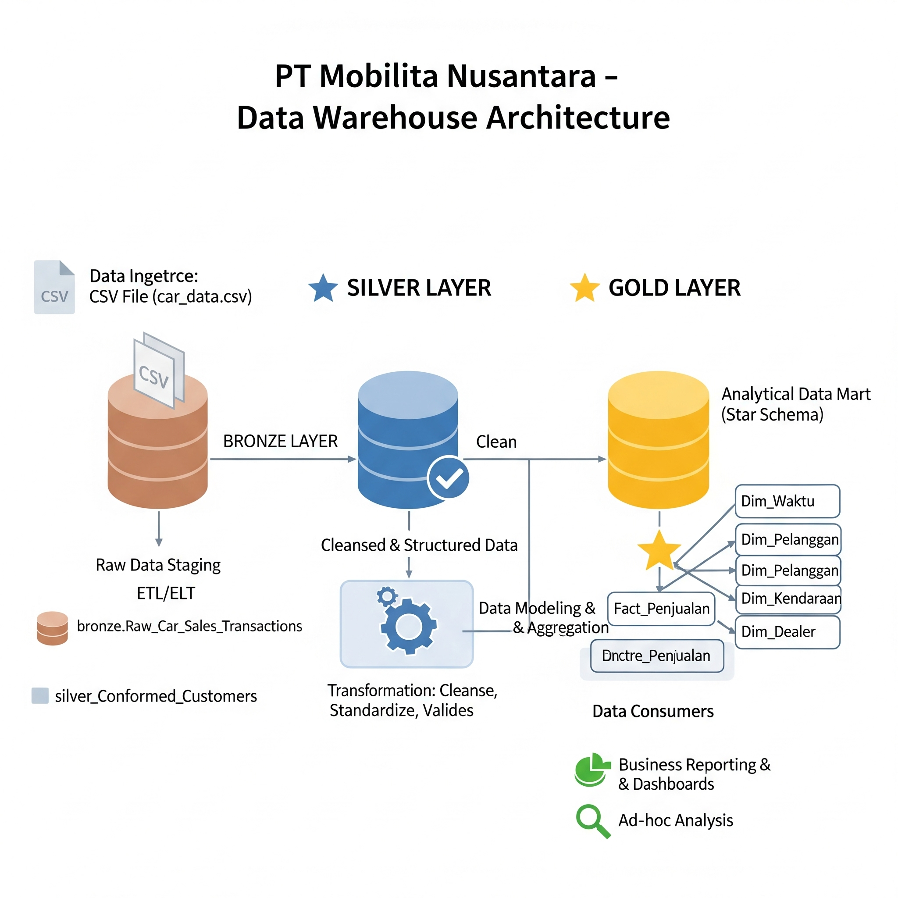

# Proyek Data Warehouse dan Analitik PT Mobilita Nusantara 🚗💨

Selamat datang di repositori **Proyek Data Warehouse dan Analitik PT Mobilita Nusantara**! 🚀
Proyek ini mendemonstrasikan solusi data warehousing dan analitik yang komprehensif untuk PT Mobilita Nusantara, sebuah perusahaan penjualan mobil bekas. Mulai dari membangun data warehouse hingga menghasilkan wawasan yang dapat ditindaklanjuti, proyek ini dirancang untuk menyoroti praktik terbaik industri dalam rekayasa dan analitik data.

---
## 🏗️ Arsitektur Data

Arsitektur data untuk proyek ini mengikuti **Medallion Architecture** dengan lapisan **Bronze**, **Silver**, dan **Gold**:

1.  **Bronze Layer**: Menyimpan data mentah apa adanya dari sistem sumber. Data di-ingest dari file CSV (`Car Sales.xlsx - car_data.csv`) ke dalam Database SQL Server.
2.  **Silver Layer**: Lapisan ini mencakup proses pembersihan data, standarisasi, dan normalisasi dasar untuk menyiapkan data untuk analisis.
3.  **Gold Layer**: Menampung data yang siap untuk bisnis, dimodelkan ke dalam star schema yang diperlukan untuk pelaporan dan analitik.

---
## 📖 Gambaran Umum Proyek

Proyek ini melibatkan:

1.  **Desain Arsitektur Data**: Merancang Data Warehouse Modern menggunakan Medallion Architecture (lapisan Bronze, Silver, dan Gold).
2.  **ETL Pipelines**: Mengekstrak, mentransformasi, dan memuat (ETL) data dari sistem sumber (file CSV) ke dalam data warehouse.
3.  **Pemodelan Data**: Mengembangkan tabel fakta dan dimensi (Star Schema) yang dioptimalkan untuk kueri analitik guna menjawab kebutuhan bisnis PT Mobilita Nusantara.
4.  **Analitik & Pelaporan**: Membuat laporan berbasis SQL dan (secara konseptual) dasbor untuk wawasan yang dapat ditindaklanjuti terkait preferensi konsumen, tren penjualan, dan performa dealer.

🎯 Repositori ini bertujuan menjadi sumber daya yang sangat baik bagi para profesional dan pelajar yang ingin menunjukkan keahlian dalam:
* SQL Development
* Data Architecture
* Data Engineering
* ETL Pipeline Development
* Data Modeling
* Data Analytics (dengan fokus pada industri otomotif/penjualan mobil bekas)

---
## 🛠️ Sumber Daya & Alat Penting:

* **Dataset**: Akses ke dataset proyek (file `Car Sales.xlsx - car_data.csv` akan ditempatkan di folder `datasets/`).
* **SQL Server Express**: Server ringan untuk menghosting database SQL Anda.
* **SQL Server Management Studio (SSMS)**: GUI untuk mengelola dan berinteraksi dengan database.
* **Git Repository**: Siapkan akun dan repositori GitHub untuk mengelola, membuat versi, dan berkolaborasi pada kode Anda secara efisien.
* **Draw.io (atau alat diagram lainnya)**: Untuk merancang arsitektur data, model, alur, dan diagram.

---
## 🚀 Persyaratan Proyek

### Membangun Data Warehouse (Data Engineering)

#### Objektif
Mengembangkan data warehouse modern menggunakan SQL Server untuk mengkonsolidasikan data penjualan mobil bekas dari PT Mobilita Nusantara, memungkinkan pelaporan analitik dan pengambilan keputusan yang terinformasi untuk:
* Memahami preferensi konsumen terhadap fitur kendaraan.
* Memantau tren harga berdasarkan model dan tahun produksi.
* Mengintegrasikan data penjualan dari berbagai sumber (konseptual, dimulai dengan CSV).

#### Spesifikasi
* **Sumber Data**: Impor data dari sistem sumber utama yang disediakan sebagai file CSV (`Car Sales.xlsx - car_data.csv`).
* **Kualitas Data**: Membersihkan dan menyelesaikan masalah kualitas data sebelum analisis di Silver Layer.
* **Integrasi**: (Untuk saat ini) Fokus pada pemrosesan sumber CSV tunggal. Desain harus mempertimbangkan integrasi sumber data tambahan di masa depan.
* **Pemodelan Data**: Data akan dimodelkan menjadi Star Schema di Gold Layer, dengan tabel fakta `Fact_Penjualan` dan dimensi seperti `Dim_Pelanggan`, `Dim_Kendaraan`, `Dim_Dealer`, dan `Dim_Waktu`.
* **Dokumentasi**: Menyediakan dokumentasi yang jelas tentang model data dan proses ETL untuk mendukung pemangku kepentingan bisnis dan tim analitik.

### BI: Analitik & Pelaporan (Data Analysis)

#### Objektif
Mengembangkan analitik berbasis SQL untuk memberikan wawasan terperinci tentang:
* **Preferensi Konsumen**: Fitur kendaraan yang paling diminati (berdasarkan `Body_Style`, `Color`, `Transmission`, `Engine`).
* **Performa Produk (Model Mobil)**: Model mobil terlaris, tren penjualan berdasarkan model dan tahun produksi.
* **Tren Penjualan**: Analisis penjualan berdasarkan waktu, wilayah dealer, dan segmen pelanggan.
* **Harga**: Analisis harga jual dan potensi untuk strategi penetapan harga yang lebih baik.

Wawasan ini memberdayakan pemangku kepentingan PT Mobilita Nusantara dengan metrik bisnis utama, memungkinkan pengambilan keputusan strategis terkait stok, pemasaran, dan penetapan harga.

*(Untuk detail lebih lanjut tentang kebutuhan bisnis spesifik, lihat laporan awal "Perancangan Data Warehouse untuk Analisis Preferensi Konsumen Kendaraan di Industri Otomotif" oleh kelompok terkait.)*

---
## 📂 Struktur Repositori

pt-mobilita-nusantara-dw/
│
├── datasets/                           # Dataset mentah yang digunakan untuk proyek (Car Sales.xlsx - car_data.csv)
│
├── docs/                               # Dokumentasi proyek dan detail arsitektur
│   ├── data_architecture.png           # Diagram arsitektur data (gambar yang telah dibuat)
│   ├── data_catalog.md                 # Katalog data untuk Gold Layer (deskripsi tabel & kolom)
│   ├── naming_conventions.md           # Panduan penamaan konsisten (jika dibuat)
│
├── scripts/                            # Skrip SQL untuk DDL, ETL, dan transformasi
│   ├── 00_init_database.sql            # Skrip untuk membuat database dan skema (opsional)
│   ├── bronze/
│   │   ├── 01_Bronze_Layer_DDL.sql
│   │   └── 02_Bronze_Layer_Load_Procedure.sql
│   ├── silver/
│   │   ├── 03_Silver_Layer_DDL.sql
│   │   └── 04_Silver_Layer_Load_Procedure.sql
│   ├── gold/
│   │   ├── 05_Gold_Layer_DDL.sql
│   │   └── 06_Gold_Layer_Load_Procedure.sql
│
├── tests/                              # Skrip pengujian kualitas data
│   ├── 07_Quality_Checks_Silver.sql
│   └── 08_Quality_Checks_Gold.sql
│
├── README.md                           # Gambaran umum proyek dan instruksi
├── LICENSE                             # Informasi lisensi untuk repositori (misalnya, MIT)
└── .gitignore                          # File dan direktori yang akan diabaikan oleh Git

---

## 🛡️ Lisensi

Proyek ini dilisensikan di bawah [MIT License](LICENSE). Anda bebas menggunakan, memodifikasi, dan membagikan proyek ini dengan atribusi yang sesuai.

---
## ✨ Kontributor (Contoh)

* Arafi Ramadhan Maulana
* Rayan Koemi Karuby
* Hermawan Manurung
* Chevando Daffa Pramanda
* Mirzan Yusuf Rabbani
* Daffa Ahmad Naufal

